# Architecture and workflows

The application factory configures extensions, private storage and Blueprints. Models remain in one compact domain module; cryptographic primitives, PKI and application services are separate from request handlers. The server is trusted for ordinary signing/decryption; the certificate-login client signs locally.

## System architecture

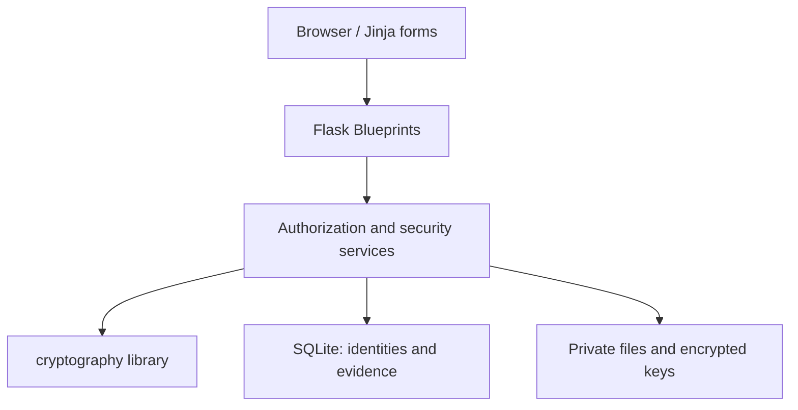

## PKI architecture

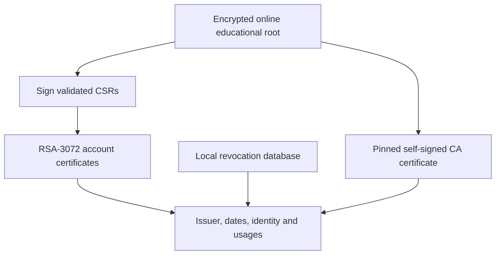

## Registration

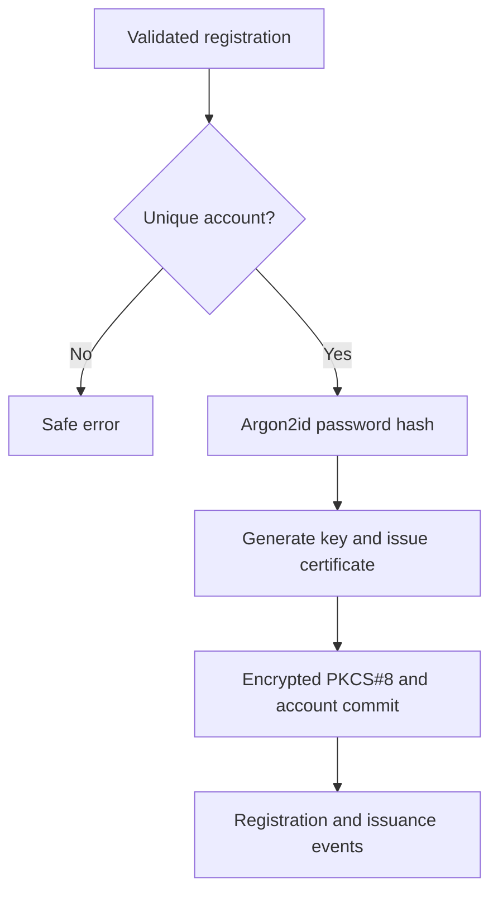

## Certificate issuance

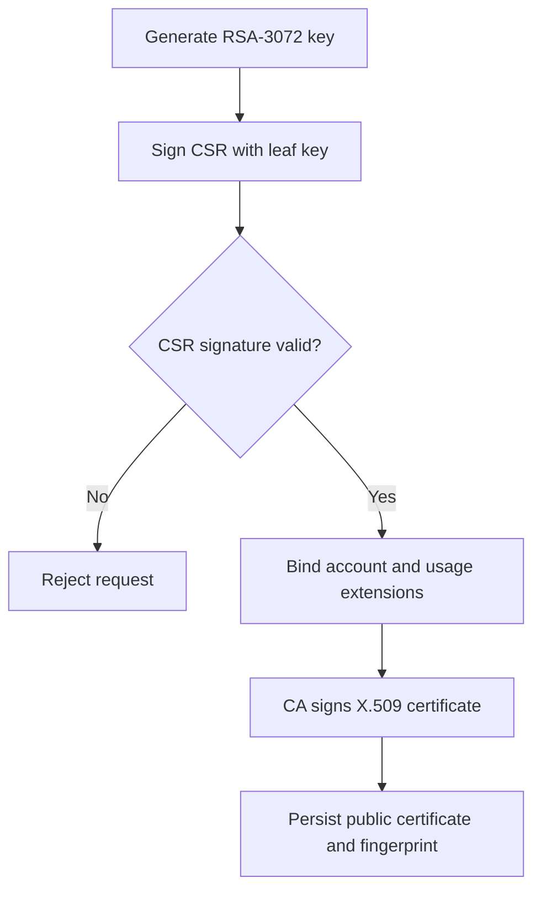

## Certificate authentication

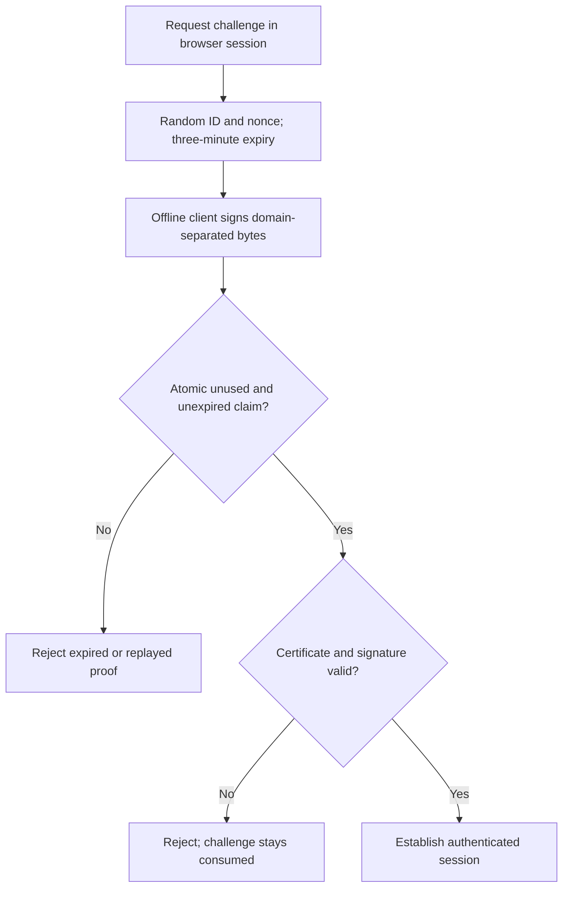

## Document signing

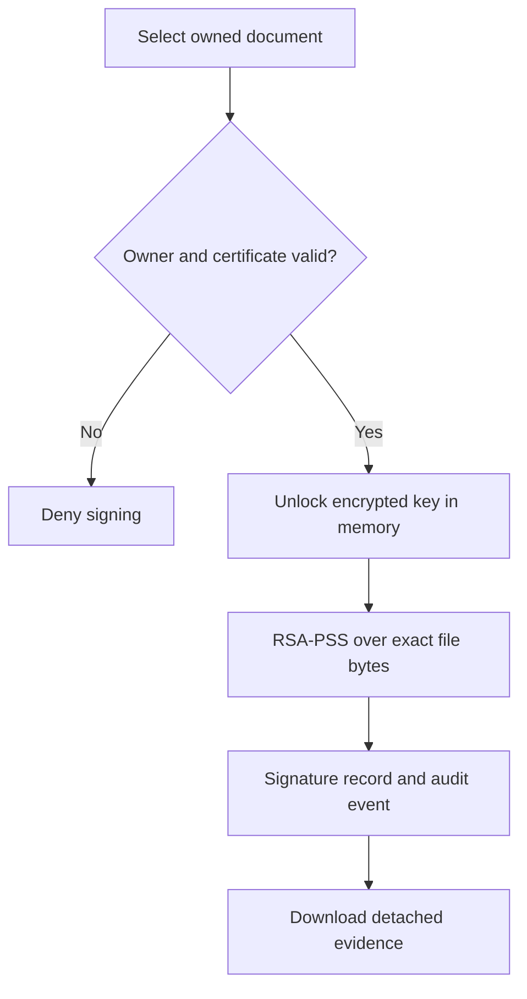

## Signature verification

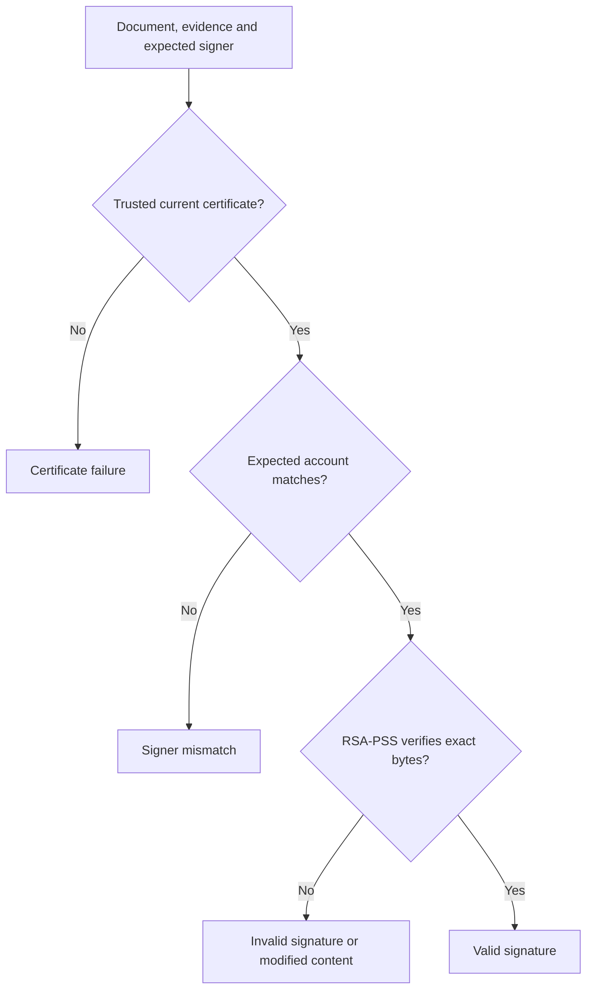

## Hybrid encryption

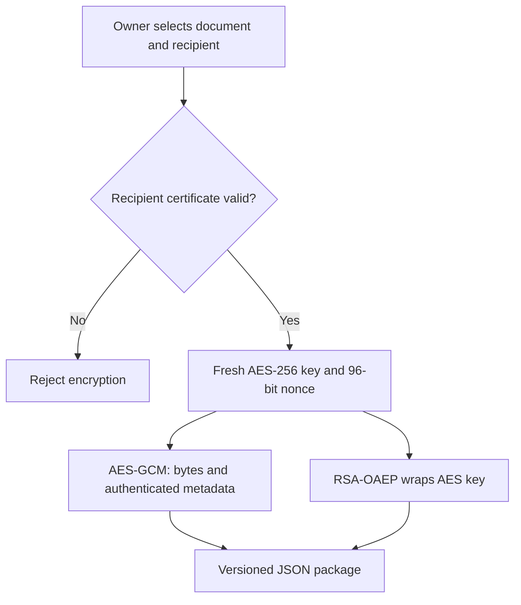

## Decryption

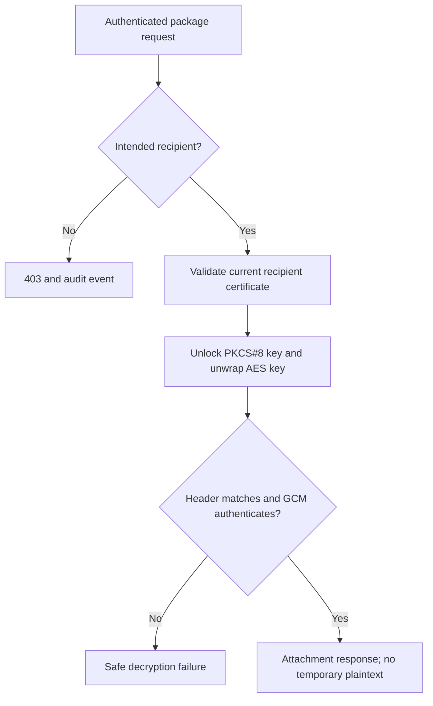

## Revocation

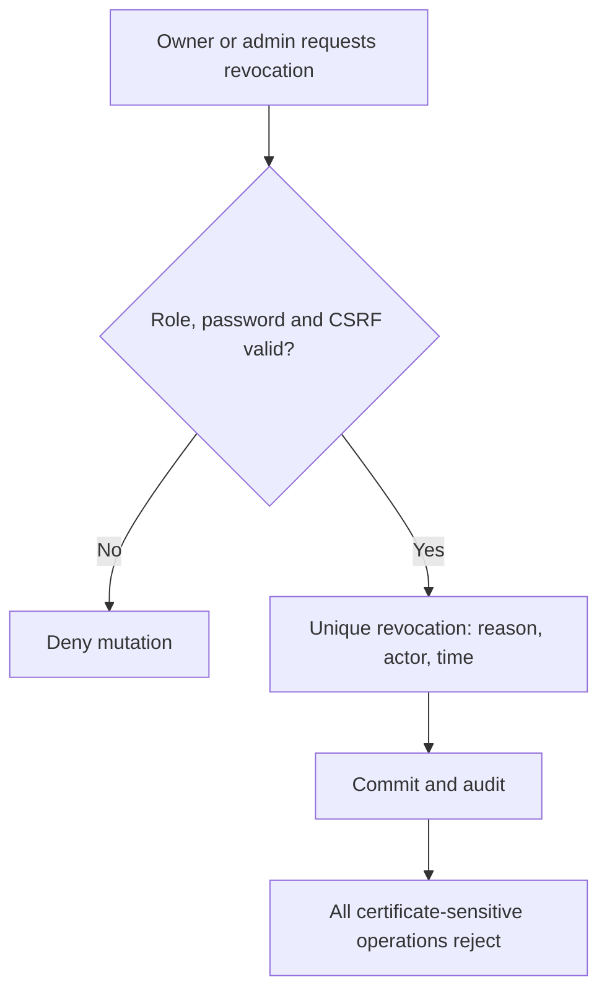

## Attack testing

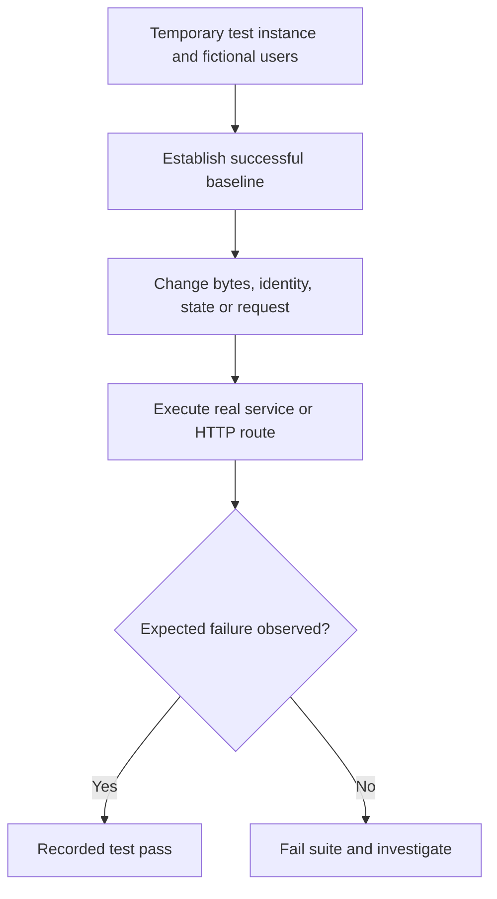

## Domain schema

User owns certificates and documents. CertificateRevocation uniquely references a certificate and records the actor. DocumentSignature links document, signer and exact certificate. EncryptedPackage records sender, recipient and recipient certificate. AuthenticationChallenge binds account, certificate, browser token, expiry and consumed flag. AuditEvent records safe event metadata only. Foreign keys and uniqueness constraints protect database associations; route checks implement per-user authorization.

Files use generated random names under the private instance, never paths supplied by a browser. The browser receives only controlled attachments. Migrations are versioned; `db.create_all` is used only for temporary test fixtures.
